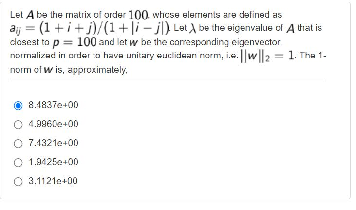

## Numerical Computing Matlab Questions
This repository includes matlab questions and their answer explanations of Linear Algebra and Geometry course in Politecnico di Torino. 

We solved questions from portale of Polito and we tried to simplify the questions as much as possible with our explanations. 

The course subjects divided into 7 sub-subjects in portale. 

### Subjects

[Syntax - Level 1 (W2)](#syntax---level-1-w2)

[Sytanx - Level 2 (W2)](#syntax---level-2-w2)

[Machine Arithmetic (W2)](#machine-arithmetic-w2)

[Interpolation (W5)](#interpolation-w5)

[Linear Systems - 1 (W9)](#linear-systems---1-w9)

[Linear Systems - 2 (W9)](#linear-systems---2-w9)

[Eigenvalues and matrix factorizations (W14)](#eigenvalues-and-matrix-factorizations-w14)

There are also 4 summarizing tests whose questions are more indicative of the types that will be used during the final test in the lab. Several topics are addressed in each quiz.

[Quiz 0 (W5)](#quiz-0-w5)

[Quiz 1 (W9)](#quiz-1-w9)

[Quiz 2 (W10)](#quiz-2-w10)

[Quiz 3 (W14)](#quiz-3-w14)

A note from Professor; 
1. Questions should **not be considered exhaustive of the course program**. Moreover, some questions are proposed with a high level of heterogeneity in terms of complexity.
2. The scores assigned during these quizzes are not related to the difficulty of the question.
3. Use the online help to understand the use of MATLAB commands that you have never dealt with.
4. You may repeat the quiz several times; typically new questions will be delivered.
5. The due time is not related to question number and/or complexity, and it is not related to the time you will be assigned for completing the quiz during the exam.
6. The different number of alternatives (4 in some cases, 5 in other ones) is not significant. The questions of the final test will have 5 alternatives.
7. For each quiz, we provide a qualitative indication of the course week in which the treatment of the topics is approximately completed so that you should be able to answer all questions in the quiz (for example W1 -> starting from week one; W4 -> starting from week four, and so on).

## Syntax - Level 1 (W2)


In this question we were asked to calculate the exact this 

```
% case 1
x1=1.7;
S1=2.1*10^-9;
y1=sqrt(x1+S1) - sqrt(x1);
y2=S1/sqrt(x1+S1) + sqrt(x1);
err1 = abs(y1-y2)/ abs(y2)

% case 2
x2=31000;
S2=7.1*10^-4;
y3=sqrt(x2+S2) - sqrt(x2);
y4=S2/sqrt(x2+S2) + sqrt(x2);

err2 = abs(y3-y4)/ abs(y4);

x1=2; 

```

## Syntax - Level 2 (W2)
## Machine Arithmetic (W2)
## Interpolation (W5)
## Linear Systems - 1 (W9)
## Linear Systems - 2 (W9)
## Eigenvalues and Matrix Factorizations (W14)

## Quiz 0 (W5)
## Quiz 1 (W9)
## Quiz 2 (W10)
## Quiz 3 (W14)