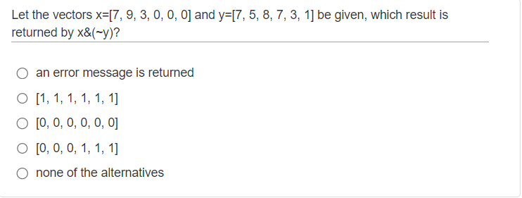
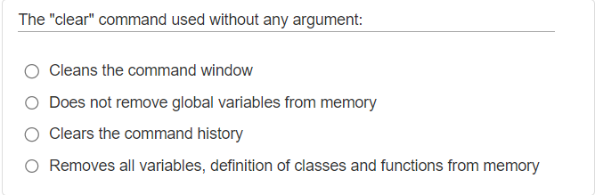
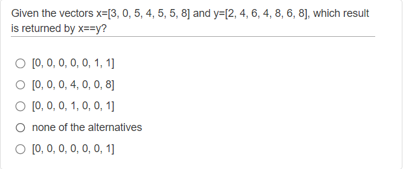
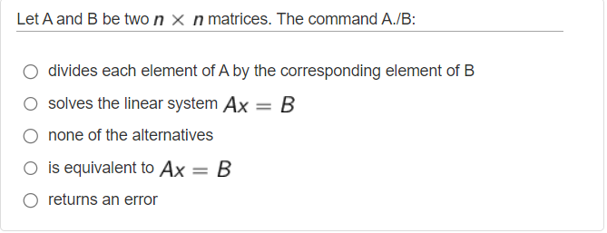
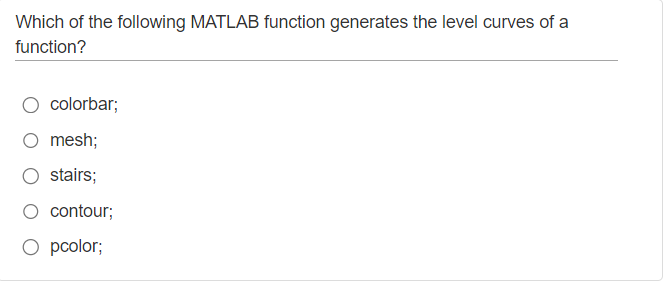

## Numerical Computing Matlab Questions
This repository includes matlab questions and their answers of Linear Algebra and Geometry course in Politecnico di Torino. 

We solved questions from portale of Polito and we tried to simplify the questions as much as possible with our explanations. 

The course subjects divided into 7 sub-subjects in portale. 

## Subjects

### [Syntax - Level 1 (W2)](#syntax---level-1-w2)

### [Sytanx - Level 2 (W2)](#syntax---level-2-w2)

### [Machine Arithmetic (W2)](#machine-arithmetic-w2)

### [Interpolation (W5)](#interpolation-w5)

### [Linear Systems - 1 (W9)](#linear-systems---1-w9)

### [Linear Systems - 2 (W9)](#linear-systems---2-w9)

### [Eigenvalues and matrix factorizations (W14)](#eigenvalues-and-matrix-factorizations-w14)

There are also 4 summarizing tests whose questions are more indicative of the types that will be used during the final test in the lab. Several topics are addressed in each quiz.

### [Quiz 0 (W5)](#quiz-0-w5)

### [Quiz 1 (W9)](#quiz-1-w9)

### [Quiz 2 (W10)](#quiz-2-w10)

### [Quiz 3 (W14)](#quiz-3-w14)

### Checkout [this section](#how-to-contribute-this-repository) below, if you want to add questions to this repository.

A note from Professor; 
1. Questions should **not be considered exhaustive of the course program**. Moreover, some questions are proposed with a high level of heterogeneity in terms of complexity.
2. The scores assigned during these quizzes are not related to the difficulty of the question.
3. Use the online help to understand the use of MATLAB commands that you have never dealt with.
4. You may repeat the quiz several times; typically new questions will be delivered.
5. The due time is not related to question number and/or complexity, and it is not related to the time you will be assigned for completing the quiz during the exam.
6. The different number of alternatives (4 in some cases, 5 in other ones) is not significant. The questions of the final test will have 5 alternatives.
7. For each quiz, we provide a qualitative indication of the course week in which the treatment of the topics is approximately completed so that you should be able to answer all questions in the quiz (for example W1 -> starting from week one; W4 -> starting from week four, and so on).

## Syntax - Level 1 (W2)
#### Q1


It asks us to write these equations in matlab. First, we can eliminate the wrong ones, in matlab after an `if` statement we use `elseif` statement to add another condition so we can eliminate option A, B and C. We have D and E options left. There is only one different in these options, `&&` and `&`. Both are logical `AND` operations. The `&&` though, is a "short-circuit" operator. From the MATLAB docs:
```
They are short-circuit operators in that they evaluate their second operand only when the result is not fully determined by the first operand. 
For example:
A & B (A and B are evaluated)
A && B (B is only evaluated if A is true)
```
So the correct answer will be `E`

#### Q2


`x & y` performs a logical `AND` of arrays x and y and returns an array containing elements set to either logical 1 (true) or logical 0 (false). An element of the output array is set to logical 1 (true) if both x and y contain a **nonzero** element at that same array location. Otherwise, the array element is set to 0.

`~y = not(y)` returns a logical array of the same size as y. The array contains logical 1 (true) values where **y is zero** and logical 0 (false) values where **y is nonzero**. So in our question it gives us an array of full zero because given y has nonzero elements.

`x&(~y)` returns a logical array of [0, 0, 0, 0, 0, 0] because we are taking their intersection. For this `&` operator to return a nonzero number, we need nonzero numbers both from x and y. Correct answer is `C`

#### Q3


A polyline is a list of points, where line segments are drawn between consecutive points.

While plotting, we can use different styles to plot our graph. There are some shorcuts for colors such as `r` is for red, `g` is for green etc. Also there are some shortcuts for line styles such as `-` is for solid line, `--` is for dashed line, `:` is for dotted line etc. So the correct answer will be `A`.

#### Q4


From Matlab documentation: `clc` clears all the text from the Command Window, resulting in a clear screen. Correct answer is `A`

#### Q5


In this question, we were asked 10 **sub-intervals**. linspace function creates n points between x and y but it creates n-1 sub-intervals between x and y points. So for this question, we need to choose linspace(-1,1,11) to get a 10 subintervals. Correct answer is `C` 

#### Q6


In this question, to divide the interval into `N` sub-intervals we need to use linspace(x,y,n+1) because linspace divides the intervals into n-1 sub-intervals but we need N amount of sub-intervals. We need to read carefully. Correct answer is `D`

#### Q7


From Matlab documentation: `clear` removes all variables from the current workspace, releasing them from system memory. `clear` removes a global variable from the current workspace but not other workspaces. Correct answer is `B`

#### Q8


`A == B` returns a logical array with elements set to logical 1 (true) where arrays A and B are equal; otherwise, the element is logical 0 (false). In this question fourth elements and seventh elements of x and y is equal so the answer will be [0 0 0 1 0 0 1]. Correct answer is `C`

#### Q9


From Matlab documentation: A./B divides each element of A by the corresponding element of B. A and B must have compatible sizes. In the simplest cases, they can be the same size or one can be a scalar. Correct answer is `A`

#### Q10


From Matlab documentation: contour(Z) creates a contour plot containing the isolines of matrix Z, where Z contains height values on the x-y plane. MATLAB® automatically selects the contour lines to display. The column and row indices of Z are the x and y coordinates in the plane, respectively. For more [checkout here](https://www.google.com/search?q=contour+level+curves+in+matlab&tbm=isch&ved=2ahUKEwiU8IjZjpT_AhXGyQIHHapECNMQ2-cCegQIABAA&oq=contour+level+curves+in+matlab&gs_lcp=CgNpbWcQAzoECCMQJ1CJDVjoF2DXG2gAcAB4AIABeYgBmAWSAQM4LjGYAQCgAQGqAQtnd3Mtd2l6LWltZ8ABAQ&sclient=img&ei=qT1xZNT3GMaTi-gPqomhmA0&bih=936&biw=882). Correct answer is `D`

## Syntax - Level 2 (W2)
## Machine Arithmetic (W2)
## Interpolation (W5)
## Linear Systems - 1 (W9)
## Linear Systems - 2 (W9)
## Eigenvalues and Matrix Factorizations (W14)
## Quiz 0 (W5)
## Quiz 1 (W9)
## Quiz 2 (W10)
## Quiz 3 (W14)

### How to contribute this repository?
1. Firstly, you can fork this repository into your github.  
2. After making sure that the questions doesn't exist in this repository, you can add your question to the related subject with your explanation.
3. For the question photo, it needs to be **screenshot**, not taken by a mobile phone camera from a pc/tablet.
4. After adding, you can commit and send a pull request to this repository. 
5. Our editors will check your request and prepare for adding to this repository.
5. Congratulations! You have provided an important support to those who will embark on this adventure. Your name is now on the contributor list!