## Numerical Computing Matlab Questions
This repository includes matlab questions and their answers of Linear Algebra and Geometry course in Politecnico di Torino. 

The story behind the project is that while we were studying for a MATLAB exam, we decided to take notes on the questions. At some point, we had the idea of sharing these notes online so that they could be useful as a study resource for all students preparing for the exam. We hope it helps.

We solved questions from portale of Polito and we tried to simplify the questions as much as possible with our explanations. 

## Subjects
The course subjects divided into 7 sub-subjects in portale. 

### [Syntax - Level 1 (W2)](#syntax---level-1-w2-1)

### [Sytanx - Level 2 (W2)](#syntax---level-2-w2)

### [Machine Arithmetic (W2)](#machine-arithmetic-w2-1)

### [Interpolation (W5)](#interpolation-w5-1)

### [Linear Systems - 1 (W9)](#linear-systems---1-w9-1)

### [Linear Systems - 2 (W9)](#linear-systems---2-w9-1)

### [Eigenvalues and matrix factorizations (W14)](#eigenvalues-and-matrix-factorizations-w14-1)

There are also 4 summarizing tests whose questions are more indicative of the types that will be used during the final test in the lab. Several topics are addressed in each quiz.

### [Quiz 0 (W5)](#quiz-0-w5-1)

### [Quiz 1 (W9)](#quiz-1-w9-1)

### [Quiz 2 (W10)](#quiz-2-w10-1)

### [Quiz 3 (W14)](#quiz-3-w14-1)

### Checkout [this section](#how-to-add-a-question-to-this-repository) below, if you want to add questions to this repository.

### For any problem or any recommendations, you can reach editors directly from [telegram group](https://t.me/numericalComputing) or  [email](mailto:itshuseyingulec@gmail.com).

A note from Professor; 
1. Questions should **not be considered exhaustive of the course program**. Moreover, some questions are proposed with a high level of heterogeneity in terms of complexity.
2. The scores assigned during these quizzes are not related to the difficulty of the question.
3. Use the online help to understand the use of MATLAB commands that you have never dealt with.
4. You may repeat the quiz several times; typically new questions will be delivered.
5. The due time is not related to question number and/or complexity, and it is not related to the time you will be assigned for completing the quiz during the exam.
6. The different number of alternatives (4 in some cases, 5 in other ones) is not significant. The questions of the final test will have 5 alternatives.
7. For each quiz, we provide a qualitative indication of the course week in which the treatment of the topics is approximately completed so that you should be able to answer all questions in the quiz (for example W1 -> starting from week one; W4 -> starting from week four, and so on).

## Syntax - Level 1 (W2)
#### Q1
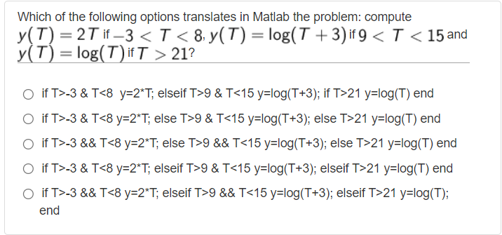

It asks us to write these equations in matlab. First, we can eliminate the wrong ones, in matlab after an `if` statement we use `elseif` statement to add another condition so we can eliminate option A, B and C. We have D and E options left. There is only one different in these options, `&&` and `&`. Both are logical `AND` operations. The `&&` though, is a "short-circuit" operator. 

From the MATLAB documentation: "They are short-circuit operators in that they evaluate their second operand only when the result is not fully determined by the first operand."

For example:

A & B (A and B are evaluated)

A && B (B is only evaluated if A is true)

Correct answer is `E`.

#### Q2


`x & y` performs a logical `AND` of arrays x and y and returns an array containing elements set to either logical 1 (true) or logical 0 (false). An element of the output array is set to logical 1 (true) if both x and y contain a **nonzero** element at that same array location. Otherwise, the array element is set to 0.

`~y = not(y)` returns a logical array of the same size as y. The array contains logical 1 (true) values where **y is zero** and logical 0 (false) values where **y is nonzero**. So in our question it gives us an array of full zero because given y has nonzero elements.

`x&(~y)` returns a logical array of [0, 0, 0, 0, 0, 0] because we are taking their intersection. For this `&` operator to return a nonzero number, we need nonzero numbers both from x and y. 

Correct answer is `C`

#### Q3


A polyline is a list of points, where line segments are drawn between consecutive points.

While plotting, we can use different styles to plot our graph. There are some shorcuts for colors such as `r` is for red, `g` is for green etc. Also there are some shortcuts for line styles such as `-` is for solid line, `--` is for dashed line, `:` is for dotted line etc. 

Correct answer is `A`.

#### Q4


From Matlab documentation: `clc` clears all the text from the Command Window, resulting in a clear screen. 

Correct answer is `A`

#### Q5
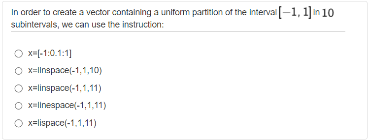

In this question, we were asked 10 **sub-intervals**. linspace function creates n points between x and y but it creates n-1 sub-intervals between x and y points. So for this question, we need to choose linspace(-1,1,11) to get a 10 subintervals. 

Correct answer is `C` 

#### Q6
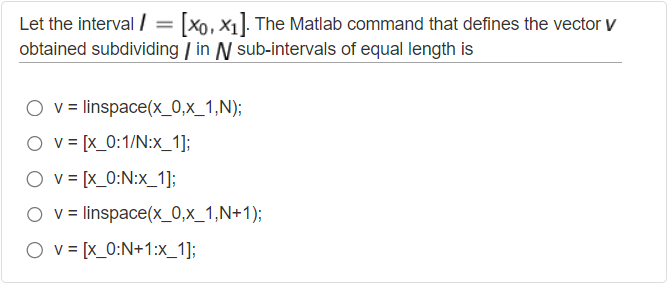

In this question, to divide the interval into `N` sub-intervals we need to use linspace(x,y,n+1) because linspace divides the intervals into n-1 sub-intervals but we need N amount of sub-intervals. We need to read carefully. 

Correct answer is `D`

#### Q7


From Matlab documentation: `clear` removes all variables from the current workspace, releasing them from system memory. `clear` removes a global variable from the current workspace but not other workspaces. 

Correct answer is `B`

#### Q8


`A == B` returns a logical array with elements set to logical 1 (true) where arrays A and B are equal; otherwise, the element is logical 0 (false). In this question fourth elements and seventh elements of x and y is equal so the answer will be [0 0 0 1 0 0 1]. 

Correct answer is `C`

#### Q9
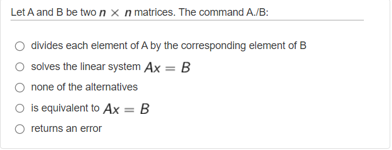

From Matlab documentation: A./B divides each element of A by the corresponding element of B. A and B must have compatible sizes. In the simplest cases, they can be the same size or one can be a scalar. 

Correct answer is `A`

#### Q10
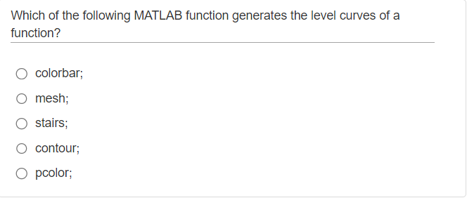

From Matlab documentation: contour(Z) creates a contour plot containing the isolines of matrix Z, where Z contains height values on the x-y plane. MATLAB® automatically selects the contour lines to display. The column and row indices of Z are the x and y coordinates in the plane, respectively. For more [checkout here](https://www.google.com/search?q=contour+level+curves+in+matlab&tbm=isch&ved=2ahUKEwiU8IjZjpT_AhXGyQIHHapECNMQ2-cCegQIABAA&oq=contour+level+curves+in+matlab&gs_lcp=CgNpbWcQAzoECCMQJ1CJDVjoF2DXG2gAcAB4AIABeYgBmAWSAQM4LjGYAQCgAQGqAQtnd3Mtd2l6LWltZ8ABAQ&sclient=img&ei=qT1xZNT3GMaTi-gPqomhmA0&bih=936&biw=882). 

Correct answer is `D`

#### Q11 
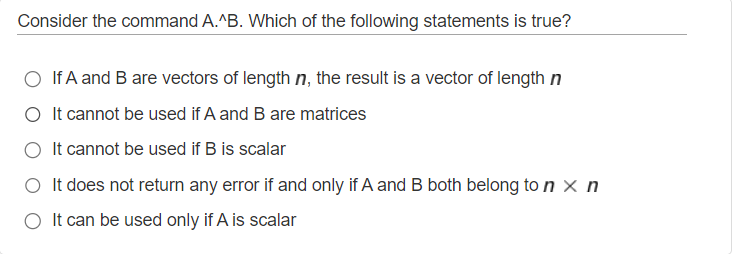

`.^`  Array power. From Matlab documentation: "A.^B denotes element-by-element powers. A and B must have compatible sizes. In the simplest cases, they can be the same size or one can be a scalar." We can eliminate option B, C and E from this definition. For option D, it doesn't needs to be n x n, we can use `.^` operator with 2 x 3 and 1 x 3 matrices so we can eliminate D. 

Correct answer is `A`

#### Q12 
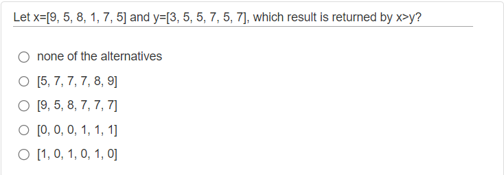

From matlab documentation: "`>`  Greater than operator. A > B does element by element comparisons between A and B and returns an array with elements set to logical 1 (TRUE) where the relation is true and elements set to logical 0 (FALSE) where it is not." 

Correct answer is `E`

#### Q13
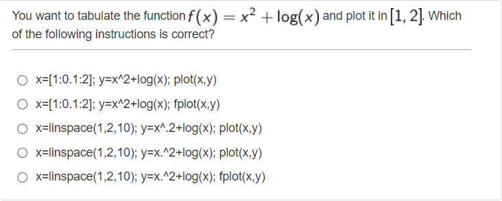

For this kind of questions, we need to be careful for small details. Question asked us to plot the function in an interval. We have x values in [1, 2] interval so we will use `plot` function because while using `fplot` function we define a function generally and let Matlab choose the x values and compute the y values. With this information, we can eliminate `fplot`, options B and E. In options A and C, there are typos in y function, it needs to be `y=x.^2+log(x)`. Be careful while using `.^`operator. 

Correct answer is `D` 

#### Q14
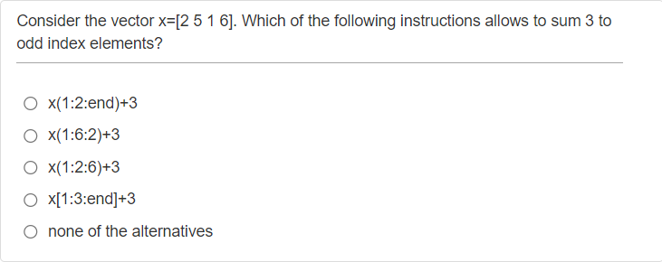

Unlike other code languages Python and Javascript, in Matlab indexing starts from 1. To get an index from given x vector, simply we can use `x(start index : number of steps : end index)`. 

Correct answer is `A`

#### Q15


From Matlab documentation: 
```
while expression
    statements
end

For example: 
while n > 1
    n = n-1;
end
```
Correct answer is `D`


## Syntax - Level 2 (W2)

***Questions will be added for this subject.***

## Machine Arithmetic (W2)

#### Q1

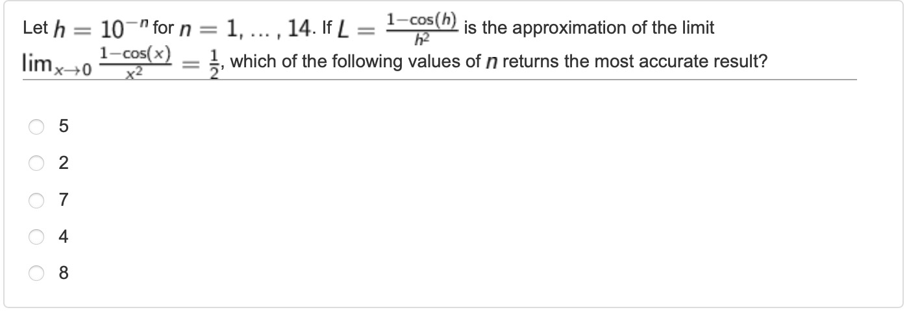

#### Q2


#### Q3

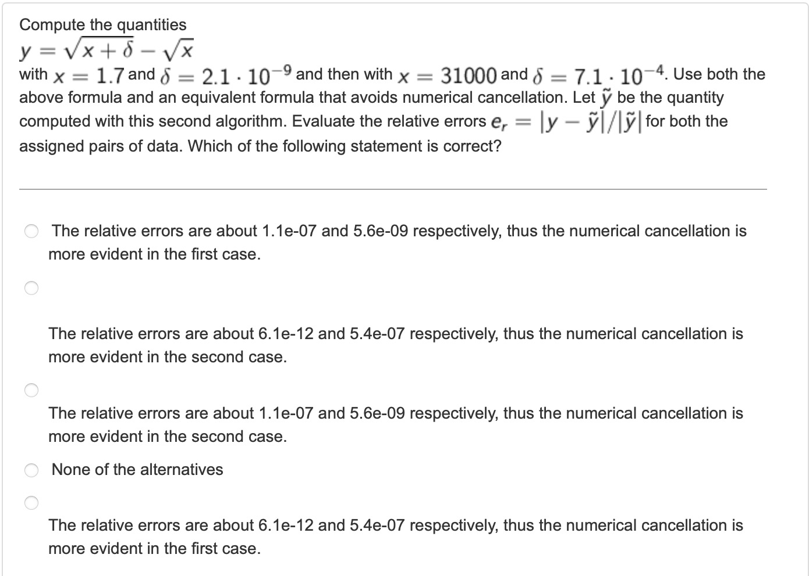

The question asks us to compute the quantities y using two different formulas for two sets of data. One formula involves directly subtracting square roots, while the other avoids numerical cancellation. We need to evaluate the relative errors between the results obtained from the two formulas for each set of data.
```

```

#### Q4

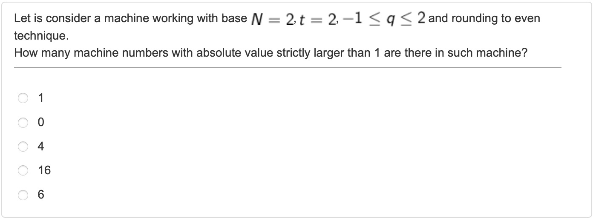

#### Q5

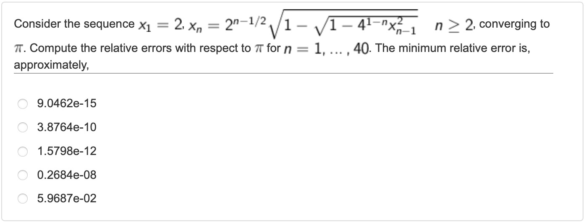

#### Q6

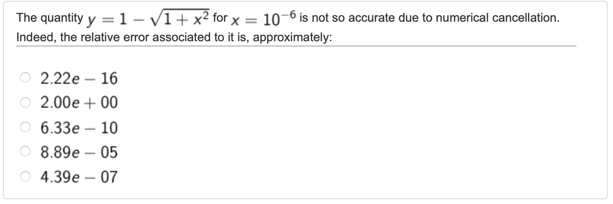

## Interpolation (W5)
#### Q1

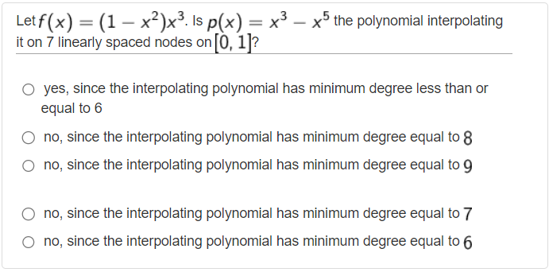

In the problem, we have a function called f(x) = (1 - x^2)x^3. We want to find a polynomial, let's call it p(x), that passes through 7 equally spaced points on the interval from 0 to 1.

The degree of a polynomial tells us the highest power of x in that polynomial. To find the degree of the interpolating polynomial, we need to determine the minimum degree required to accurately represent the function f(x) using those 7 points.

In this case, the interpolating polynomial p(x) is expected to have a minimum degree equal to the number of points minus 1, which in this case is 7 - 1 = 6. However, the polynomial p(x) = x^3 - x^5 has a degree of 5, which is less than 6.

Since the degree of p(x) is lower than the minimum required degree of 6, we cannot use p(x) to accurately interpolate the function f(x) on the given points.

Therefore, the correct answer is `E) no, since the interpolating polynomial has a minimum degree equal to 6`.

#### Q2

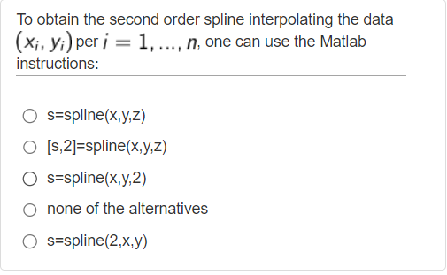

An explanation will be added for this question.

#### Q3

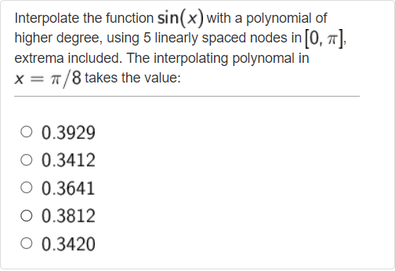

To interpolate the function f(x) = sin(x) with a polynomial of higher degree using 5 linearly spaced nodes in the interval [0, π], including the extrema, When we say "linearly spaced nodes including extrema," it means that we want to choose equidistant points within the interval [0, π], with the endpoints 0 and π included. In this case, with 5 linearly spaced nodes, we will have the following x-values:

x = [0, π/4, π/2, 3π/4, π]

Including the extrema ensures that the interpolation polynomial will pass through those specific points as well.
we can use the MATLAB instructions as follows:
1. Define the x-values of the 5 linearly spaced nodes, including the extrema:

2. Calculate the y-values of the function f(x) = sin(x) at the given x-values:

3. Use the `polyfit` function in MATLAB to fit a polynomial of a higher degree to the data points.

For interpolation with 5 points, a polynomial of degree 4 can perfectly fit the data points, as it can pass through all 5 points. Thus, you would typically use a polynomial of degree 4 for this case.

Therefore, you should input a degree of 4 when using the polyfit function to fit the polynomial to the 5 data points.

4. Evaluate the polynomial at x = π/8 to find the value of the interpolating polynomial at that point:

The `polyval` function returns the value of the polynomial `p` at the point `x1`.

By following these steps, you can interpolate the function sin(x) with a polynomial of higher degree using 5 linearly spaced nodes in the interval [0, π]. The value of the interpolating polynomial at x = π/8 will be stored in the variable `y1`.
```
clear all
x=linspace(0,pi,5); 
y = sin(x);
p = polyfit(x,y,4);
x1= pi/8;
y1= polyval(p,x1)
```

Correct answer is 0.3812, in this case, `D`.

#### Q4
#### Q5
#### Q6


## Linear Systems - 1 (W9)

***Questions will be added for this subject.*** 

## Linear Systems - 2 (W9)

***Questions will be added for this subject.***

## Eigenvalues and Matrix Factorizations (W14)

#### Q1

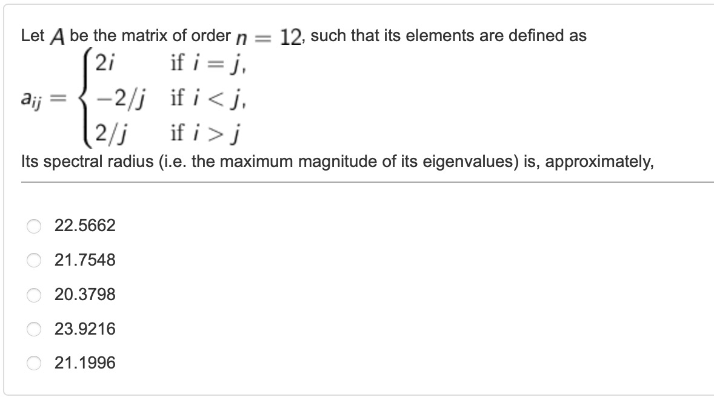

The question asks us to find the spectral radius of a matrix A. Matrix A defined specifically in the question so we will create the matrix in a for loop.

The spectral radius of a matrix is the maximum magnitude of its eigenvalues. In other words, it is the largest absolute value among the eigenvalues of the matrix.

```
clear all
n = 12; % Order of the matrix A
A = zeros(n);

for i = 1:n
    for j = 1:n
        if i == j
            A(i,j) = 2*i;
        elseif i < j
            A(i,j) = -2/j;
        elseif i > j
            A(i,j) = 2/j;
        end
    end
end
format default
max(abs(eig(A)))
```

Correct answer is 23.9216, in this case, `E`.

#### Q2

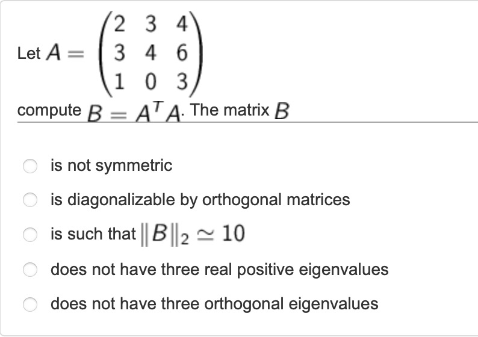

The question asks us to analyze the properties of a given matrix B.

First of, we can find the matrix B by using basic matlab code. 

```
clear all
A = [2 3 4; 3 4 6; 1 0 3];
B = A'*A

ans = 
        B =

            14    18    29
            18    25    36
            29    36    61
```

With this information, we can analyze given statements in the question. 

In option A, it is said that matrix B is not symmetric which means matrix B does not equal to its transpose but as we saw from the matrix B, it is symmetric so option A is false.

In linear algebra, a square matrix B is said to be diagonalizable if it can be written in the form B = PDP', where P is an orthogonal matrix and D is a diagonal matrix. In option B, it is said that the matrix B is diagonalizable by orthogonal matrices which means that we can find an orthogonal matrix P and a diagonal matrix D such that B = PDP'. In the context of the given matrix B, we know that B is symmetric. For symmetric matrices, it is always possible to diagonalize them using orthogonal matrices. This property is known as the Spectral Theorem for Symmetric Matrices so option B is True.

In option C, it is said that the matrix norm of B, is approximately 10. We can find this by using matlab code after creating matrix B, ```norm(B, 2)``` so in this case it is 97,2442, approximately 100. Therefore, the option C is false.

In option D, it is said that the matrix B does not have three real positive eigenvalues. However, based on the given matrix B, we can find that all its eigenvalues(by using ```eig(B)``` code) (approximately  0.0037, 2.7521, 97.2442) are real and positive. Therefore, the option D is false.

In option E, it is said that the matrix B does not have three orthogonal eigenvalues. This option implies that the eigenvalues of B are not mutually orthogonal. To determine whether this is true, we need to calculate the eigenvectors of B. However, the given information does not provide us with the eigenvectors. Therefore, we cannot conclude whether B has three orthogonal eigenvalues or not.

Correct answer is `B`.

#### Q3 

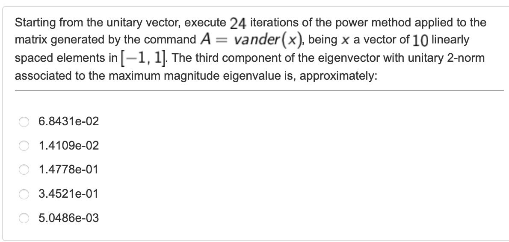

The question asks us to use the Power Method for 24 iterations on a Vandermonde matrix A generated from a vector x with 10 equally spaced elements between -1 and 1. We need to find the approximate value of the third component of the eigenvector associated with the largest eigenvalue in terms of magnitude.

```
clear all

x=linspace(-1,1,10);

A=vander(x);
z=ones(10,1);
w=z/norm(z);

for i=1:24
    z=A*w;
    lambda(i+1)=w'*z;
    w=z/norm(z);
end
w(3)
```

In the first part of the matlab code, it creates a vector `x` with 10 equally spaced points between -1 and 1 using the linspace function.

Then, it generates a Vandermonde matrix A using the vector `x`. Each column of the matrix A is formed by raising the corresponding element of the vector `x` to a power.

Then, `z` is initialized as a column vector of ones, and `w` is obtained by normalizing `z`. The purpose of this is to initialize `w` as a starting vector for an iterative process called the Power Method, used to find the dominant eigenvalue and eigenvector of a matrix.

Then, we use for loop to run 24 iterations of the Power Method. In each iteration, it updates the vector `z` by multiplying matrix A with the vector `w`, then it calculates the Rayleigh quotient `lambda(i + 1)`, which represents an approximation to the dominant eigenvalue of matrix A, using the current vector `w` and the updated vector `z`. The vector `w` is then updated as the normalized version of `z`.

Finally, the code outputs the third element of the vector `w`. Since the Power Method aims to find the dominant eigenvector of the matrix A, the third element of `w` represents an approximation to the corresponding component of the dominant eigenvector.

Correct answer is 1.4778e-01, in this case, `C`.

#### Q4

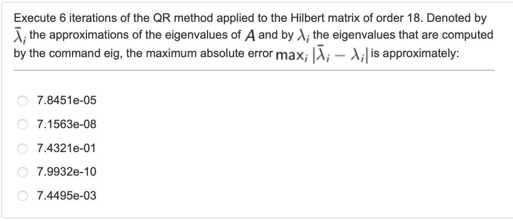

The question asks us to use the QR method iteratively for 6 iterations on the Hilbert matrix of order 18. The objective is to approximate the eigenvalues of the matrix using this method. Then, we need to calculate the maximum absolute error between the approximated eigenvalues and the actual eigenvalues obtained from the `eig` command. The error is measured as the maximum absolute difference between corresponding eigenvalues.

```
clear all

A=hilb(18);

for i=1:6
    [Q,R]=qr(A);
    A=R*Q;
end

max(abs(diag(A)-eig(A)))
```

In the first line, it generates the Hilbert matrix of order 18 using the hilb function.

Then, the for loop iterates 6 times and applies the QR factorization method to the matrix A. In each iteration:, the qr function decomposes matrix A into its QR factors, Q (orthogonal matrix) and R (upper triangular matrix). The updated matrix A is obtained by multiplying R and Q together.

In the last line of code, `diag(A)` returns a column vector containing the diagonal elements of matrix A. These diagonal elements correspond to the approximated eigenvalues obtained from the QR method after the specified number of iterations.

By subtracting `eig(A)` from `diag(A)`, the code calculates the differences between the approximated eigenvalues (`diag(A)`) and the actual eigenvalues (`eig(A)`). The `max(abs(...))` function then calculates the maximum absolute difference among these differences, providing an estimate of the maximum absolute error in the eigenvalue approximation.

Correct answer is 7.1563e-08, in this case, `B`.

#### Q5

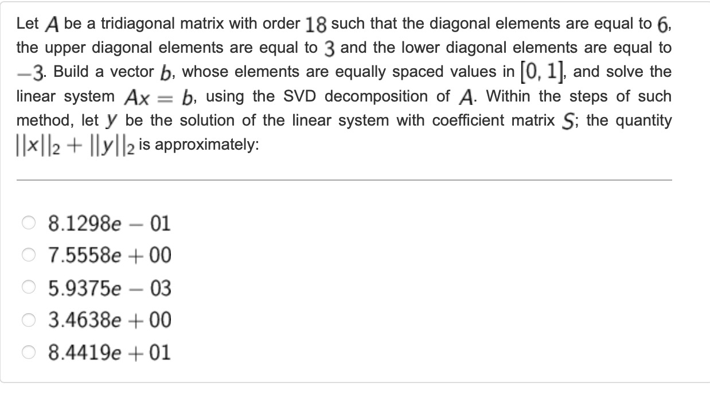

The question involves solving a linear system Ax = b, where matrix A is a tridiagonal matrix and vector b has equally spaced values. The SVD (Singular Value Decomposition) method is used to solve the system.

```
clear all
n = 18;  % order of the matrix
A = diag(6*ones(n,1)) + diag(3*ones(n-1,1), 1) + diag(-3*ones(n-1,1), -1);
b = linspace(0, 1, n)';

[U, S, V] = svd(A);
y = inv(S) * (U' * b); % also works S \ (U' * b)
x = V * y;

norm(x, 2) + norm(y, 2)
```

First we defined matrix A as a tridiagonal matrix of order 18, with diagonal elements equal to 6, upper diagonal elements equal to 3, and lower diagonal elements equal to -3. Vector b is constructed with equally spaced values in the range [0, 1].

Then we used svd function which is computes the singular value decomposition of matrix A. The output consists of three matrices: U, S, and V. U and V are orthogonal matrices, and S is a diagonal matrix containing the singular values of A.

The equation Ax = b is solved by multiplying the pseudo-inverse of A, given by inv(S) * (U' * b), with b. The resulting vector y represents the solution of the linear system with the coefficient matrix S. Then, the solution vector x is obtained by multiplying V with y.

Finally we calculate the quantity x_2 + y_2 by using `norm` function.

Correct answer is 8.1298e-01, in this case, `A`.

#### Q6

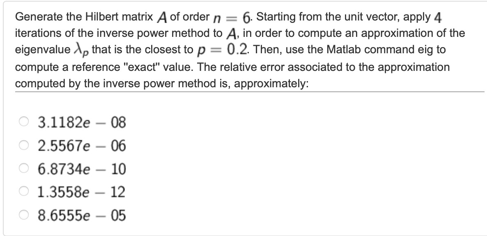

The question asks us to perform certain calculations using the Hilbert matrix, the inverse power method, and the eig command in MATLAB.

Inverse Power Method: The inverse power method is an iterative algorithm used to approximate eigenvalues of a matrix. It relies on the fact that the eigenvector corresponding to the smallest eigenvalue of the matrix A is approximately the limit of the sequence (A - pI)^(-k) * x, where p is an approximation to the desired eigenvalue, I is the identity matrix, k is the number of iterations, and x is the initial unit vector. By applying this iterative process, we can approximate the eigenvalue λ_p that is closest to the value p=0.2. Each iteration involves solving a linear system of equations.

LU decomposition is used in the provided code to solve a system of linear equations efficiently. In the context of the inverse power method, LU decomposition helps in solving the linear systems that arise during each iteration of the method. By utilizing LU decomposition, the question is solved the linear systems (A - pI)x = y during each iteration of the inverse power method more efficiently than direct methods like Gaussian elimination. This helps in improving the overall performance and computational efficiency of the code.

Computing the reference "exact" value: To validate the result obtained from the inverse power method, the eig command in MATLAB can be used. This command computes all eigenvalues of a given matrix A, and we can then select the eigenvalue that is closest to the desired value p=0.2.

```
clear all
n=6;
A=hilb(n);
p=0.2;
z=ones(n,1);
w=z/norm(z);
lambda(1)=p;
[L,U,P]=lu(A-p*eye(n));
for i=1:4
    y=inv(L) * P*w; % also works y = L \ P*W
    z=inv(U) * y;      % also works z = U \ y
    lambda(i+1) = p+1 / (w'*z);
    w = z / norm(z);
end
approximated_val = eigs(A,1,p);
error = abs ( lambda(i+1)-approximated_val ) / abs( approximated_val )
```

First we define our order(n) and hilbert matrix. Then we use inverse power method, initializes `p` to the desired value (0.2), sets up the initial vector `z` as a vector of ones, and normalizes it to get `w`.

It performs LU decomposition of A - p * eye(n) using the lu function, obtaining the lower triangular matrix L, upper triangular matrix U, and permutation matrix P.

The inverse power method is applied iteratively for four iterations. In each iteration:

The equation L * y = P * w is solved using forward substitution to obtain `y`.
The equation U * z = y is solved using back substitution to obtain `z`.
The updated eigenvalue estimate is stored in lambda by adding `p` to the reciprocal of the dot product of `w` and `z`.
`w` is then updated by normalizing `z`.

Then the code uses the eigs function to compute the eigenvalue closest to `p` for the matrix A, specifying that it should find the eigenvalue with the smallest magnitude (1).
The resulting eigenvalue is assigned to approximated_val as the reference "exact" value.

Finally, the absolute difference between the estimated eigenvalue (lambda(i + 1)) obtained from the inverse power method and the computed eigenvalue (approximated_val) is divided by the absolute value of approximated_val to calculate the relative error.

Correct answer is 2.5567e-06, in this case, `B`.

#### Q7

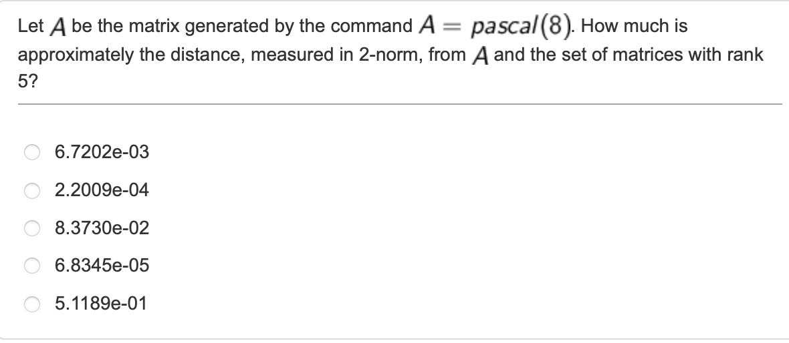

The question asks us to calculate the approximate distance, measured in the 2-norm, between the matrix A generated by the command A = pascal(8) and the set of matrices with rank 5.

The first thing we need to do is to generate the Pascal matrix of order 8 using the command A = pascal(8). The Pascal matrix is a specific type of matrix where each element is the binomial coefficient of its row and column.

Then we need to calculate the set of matrices with rank 5 using Singular Value Decomposition (SVD). The Singular Value Decomposition (SVD) is a matrix factorization technique that decomposes a matrix into three matrices: U, S, and V. For a given matrix A, the SVD is represented as A = U * S * V', where U and V are orthogonal matrices (U'U = V'V = I) and S is a diagonal matrix containing the singular values of A.

In this case, we want to find the set of matrices with rank 5. By performing the SVD on matrix A, we can extract the singular values and vectors that represent the importance of each dimension in A. The singular values in the diagonal matrix S are sorted in descending order, indicating their relative significance. By keeping only the first five singular values and their corresponding singular vectors, we can construct a matrix A_rank_5 with rank 5.

After obtaining the singular value decomposition (A = U * S * V'), we truncate(cut) the matrices U, S, and V to only include the information related to the first five singular values. By multiplying the truncated matrices, U(:, 1:5), S(1:5, 1:5), and V(:, 1:5)', we obtain the reconstructed matrix A_rank_5 with rank 5.

The purpose of this is to create a matrix that retains the most significant components of the original matrix A. By using only the first five singular values and their corresponding singular vectors, we effectively reduce the rank of the matrix to 5 while capturing the essential features of the original matrix.

By calculating the distance between the original matrix A and the reconstructed matrix A_rank_5, we can measure how far they are from each other in terms of the 2-norm. This distance provides an indication of how well the rank-5 approximation represents the original matrix. It allows us to quantify the loss of information or the approximation error between the two matrices.
```
clear all

A = pascal(8); 

[U, S, V] = svd(A);
A_rank_5 = U(:, 1:5) * S(1:5, 1:5) * V(:, 1:5)';

distance_2_norm = norm(A - A_rank_5, 2)
```

Correct answer is 8.3730e-02, in this case, `C`

#### Q8

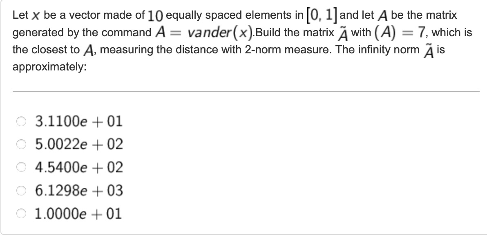

First of all, let's analyze the question.  Let x be a vector made of 10 equally spaced elements in the interval [0,1] which means the vector x contains 10 values that are evenly spaced between 0 and 1.

The command `A=vander(x)` generates a Vandermonde matrix using the vector x. A Vandermonde matrix is a special type of matrix where each column is formed by raising the corresponding element of the input vector to a power. In this case, each column of A will contain powers of the elements in vector x.

Our goal is to construct a new matrix `An` that is as close as possible to matrix A, but with a rank of 7. The rank of a matrix represents the maximum number of linearly independent rows or columns it contains.

The question mentions measuring the distance between matrices using the 2-norm measure. The 2-norm of a matrix is calculated by taking the square root of the sum of the squares of its elements. However, in this case, we need to clarify what is meant by "closest" and how it relates to the 2-norm measure.

The question also asks for the infinity norm of matrix `An`. The infinity norm of a matrix is the maximum absolute row sum of the matrix. In other words, it measures the largest value obtained by summing the absolute values of the elements in each row of the matrix.

```
clear all

x = linspace(0, 1, 10);
A = vander(x);

[U, S, V] = svd(A);

An = U(:, 1:7) * S(1:7, 1:7) * V(:, 1:7)';

norm(An, inf)
```

The code starts by generating a vector `x` using the linspace function. The linspace function creates a linearly spaced vector of 10 elements between 0 and 1.

Then, it generates a Vandermonde matrix A using the generated vector `x` with the vander function. Each column of A is formed by raising the corresponding element of `x` to a power.

Then, it applies the Singular Value Decomposition to matrix A using the svd function. SVD decomposes A into three matrices: U, S, and V.

Then, it performs a low-rank approximation of the matrix A by selecting the dominant singular values and vectors. It achieves this through the following steps:

1. U(:, 1:7) selects the columns 1 to 7 from the matrix U, corresponding to the dominant singular vectors.
2. S(1:7, 1:7) selects the top-left 7x7 block from the matrix S, which includes the dominant singular values.
3. V(:, 1:7) selects the columns 1 to 7 from the matrix V, corresponding to the dominant right singular vectors.

Multiplying these three matrices together, U(:, 1:7) * S(1:7, 1:7) * V(:, 1:7)', produces the low-rank approximation matrix An.

Finally, it calculates the infinity norm of the matrix `An` using the norm function with the argument `inf`. The `inf` argument specifies that the infinity norm should be computed. 

In the given code, SVD is used to compute the dominant singular values and vectors of the Vandermonde matrix `A`. These dominant components are then used to construct a low-rank approximation matrix `An`. By using SVD, we can effectively analyze the structure of `A` and derive a reduced-rank approximation, which can be useful in various applications such as data compression, noise reduction, and dimensionality reduction.

Correct answer is 1.0000e+01, in this case, `E`.

#### Q9

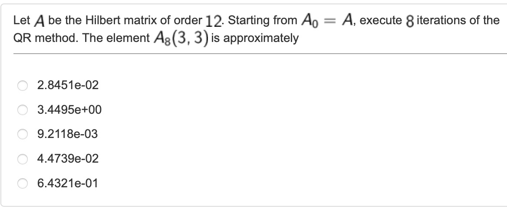

The question is asking us to perform 8 iterations of the QR method on the Hilbert matrix of order 12, starting with matrix A₀ = A. The Hilbert matrix is a specific type of matrix where its entries are given by the formula A(i, j) = 1 / (i + j - 1).

The QR method is an iterative numerical algorithm used to find the eigenvalues (and eigenvectors) of a matrix. In each iteration, the matrix A is decomposed into a product of an orthogonal matrix Q and an upper triangular matrix R. The resulting matrix R is then multiplied by Q to obtain the updated matrix A for the next iteration which is A = R*Q in matlab.

The question specifically asks for the approximate value of element A₈(3,3) after 8 iterations of the QR method. This means we need to perform the QR iterations as described above and retrieve the value at the third row and third column of the resulting matrix A after 8 iterations.

``` 
clear all 

format long e

A = hilb(12);
for i=1:8
    [Q, R] = qr(A);
    A = R*Q;
end
A(3,3)
```
First line creates a 12x12 Hilbert matrix and assigns it to the variable A. The hilb function generates the Hilbert matrix based on the specified order, in this case, 12.

The for loop performs 8 iterations of the QR method. In each iteration, the qr function decomposes matrix A into an orthogonal matrix Q and an upper triangular matrix R. The updated matrix A is obtained by multiplying R and Q. This process is repeated 8 times, as indicated by the loop.

Last line retrives the value at the third row and third column of the resulting matrix A after 8 iterations of the QR method.

Correct answer is 4.47e-02, in this case, `C`

#### Q11

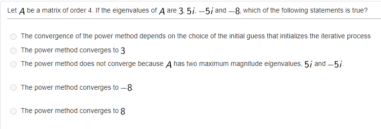

In this question, we are given a matrix A of order 4, and the eigenvalues of A are 3, 5i, -5i, and -8.

The power method is an iterative algorithm used to find the dominant eigenvalue and its corresponding eigenvector of a matrix. It relies on the observation that if you repeatedly multiply a vector by a matrix and normalize the result, it will converge towards the eigenvector associated with the dominant eigenvalue. The algorithm assumes that the matrix has a dominant eigenvalue, meaning an eigenvalue with the largest magnitude.

For option A, "The convergence of the power method depends on the choice of the initial guess that initializes the iterative process."

-The convergence of the power method does not depend on the choice of the initial guess that initializes the iterative process. The power method is designed to converge to the dominant eigenvalue regardless of the initial guess, as long as the matrix has a dominant eigenvalue.

-The power method relies on the repeated multiplication of a vector by the matrix, normalizing it at each iteration. This iterative process gradually aligns the vector with the eigenvector corresponding to the dominant eigenvalue. The convergence behavior depends on the matrix itself, particularly its eigenvalue distribution, rather than the initial guess.

For option B, "The power method converges to 3."

-This option is false. The power method converges to the dominant eigenvalue, which is the eigenvalue with the largest magnitude. In this case, the eigenvalue with the largest magnitude is -8, not 3.

For option C, "The power method does not converge because A has two maximum magnitude eigenvalues, 5i and -5i."

-This option is false. While it is true that matrix A has two eigenvalues with the same maximum magnitude (5i and -5i), the power method can still converge in such cases. It converges to the dominant eigenvalue, which is the eigenvalue with the largest magnitude. In this case, the dominant eigenvalue is -8.

For option D, "The power method converges to -8."

-This option is true. As explained earlier, the power method converges to the dominant eigenvalue, which is the eigenvalue with the largest magnitude. In this case, the dominant eigenvalue is -8. Therefore, the power method converges to -8.

For option E, "The power method converges to 8."

-This option is false. The power method converges to the dominant eigenvalue, which is the eigenvalue with the largest magnitude. In this case, the dominant eigenvalue is -8, not 8.

Correct answer is `D`. 

#### Q12

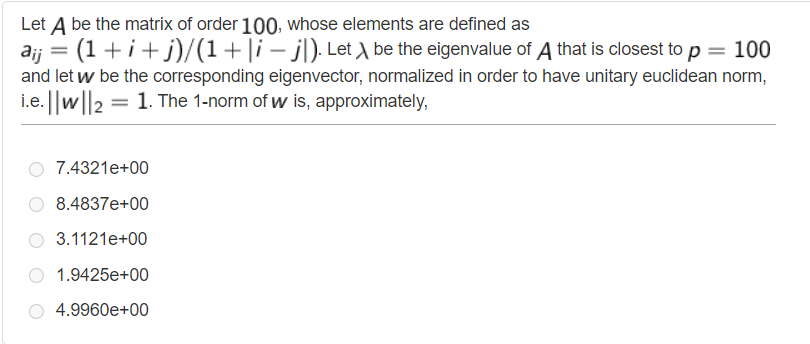

The question asks us to perform calculations on a given matrix A and find the 1-norm of a specific eigenvector.

The matrix A is of order 100, meaning it is a square matrix with dimensions 100x100. The elements of A are defined using the formula a_{ij}=(1+i+j)/(1+|i-j|), where i and j are the row and column indices, respectively.

Our task is to find the eigenvalue of A that is closest to p=100. An eigenvalue of a matrix is a scalar value that, when multiplied by its corresponding eigenvector, gives back the same vector. In this case, we need to find the eigenvalue that is closest to p=100.

Once we find the closest eigenvalue, we are asked to find the corresponding eigenvector and normalize it such that its 2-norm (Euclidean norm) is equal to 1.

Finally, we need to calculate the 1-norm of the normalized eigenvector. The 1-norm of a vector is the sum of the absolute values of its elements.

```
clear all
n = 100;
A = zeros(n); 

for i=1:n
    for j=1:n
        A(i,j)=(1+i+j)/(1+abs(i-j));
    end
end

p=100;
[z,D]=eigs(A,1,p);

w=z/norm(z);
format short e
norm(w,1)
```

In the matlab code, first we have defined our order(n) and an empty matrix A with zeros(100). Then we defined the matrix A with given formula inside of a for loop.

Then we set `p` to 100, which indicates the desired number of eigenvalues and eigenvectors to be computed.

Then we used eigs function which is used to calculate the eigenvalues and eigenvectors of matrix A. The function call eigs(A, 1, p) indicates that we want to compute one eigenvalue/vector pair, and the value of p is used as a parameter to guide the selection of the eigenvalue. The function returns two outputs: `z` and `D`.

1. `z` is a column vector representing the eigenvector corresponding to the computed eigenvalue. It is the solution of the eigenvalue problem.
2. `D` is a diagonal matrix containing the computed eigenvalues. Since we requested only one eigenvalue/vector pair, D will be a 1x1 matrix with the computed eigenvalue.

By using this syntax (`[z, D]`), we assign the computed eigenvector to the variable `z` and the computed eigenvalue to the variable `D`. This allows us to access and use these values later in the code.

The eigenvector `z` obtained from the eigs function is normalized by dividing it by its 2-norm, computed using the norm function. This step ensures that the resulting eigenvector `w` has a Euclidean norm of 1.

Finally, the norm function is used to calculate the 1-norm of the normalized eigenvector `w`. The norm is computed by summing the absolute values of its elements.

Correct answer is 8.4837e+00, in this case, `B`.

#### Q13

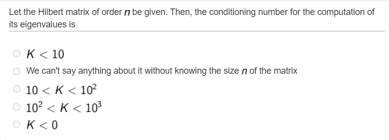

The question is related to the conditioning number of the Hilbert matrix of order n and its eigenvalues. The Hilbert matrix is a specific type of matrix that has entries defined as H(i,j) = 1 / (i + j - 1), where i and j are the row and column indices, respectively.

The conditioning number measures the sensitivity of a problem to changes in its input. In this case, it refers to the sensitivity of computing the eigenvalues of the Hilbert matrix to perturbations or errors in the matrix.

The Hilbert matrix is well-known for being ill-conditioned, meaning that small changes in its entries can lead to large changes in its eigenvalues. However, the specific value of the conditioning number (K) depends on the size (order) of the matrix.

For small values of n (order of the matrix), the Hilbert matrix has a relatively low conditioning number. As n increases, the conditioning number grows rapidly, indicating increased sensitivity to perturbations.

However, without knowing the size n of the matrix in the given question, we cannot determine the exact conditioning number. Therefore, the most conservative assumption we can make is that K<10, implying that the conditioning number is less than 10.

This assumption is based on the fact that for small to moderate values of n, the conditioning number of the Hilbert matrix tends to be less than 10. It allows for a more general and cautious statement without relying on specific matrix sizes.

Correct answer is `A`.

#### Q14

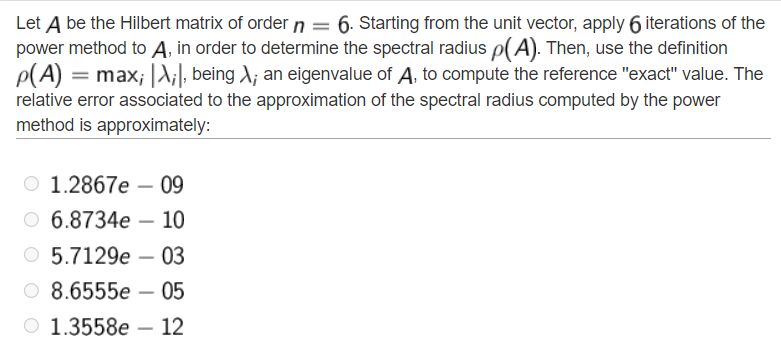

The question asks us to determine the spectral radius of a Hilbert matrix of order 6, denoted as A, using the power method. The power method involves iteratively multiplying a vector by A, normalizing it, and repeating this process several times. After 6 iterations, the resulting vector is used to estimate the dominant eigenvalue and the spectral radius. The question also asks us to compute the exact value of the spectral radius using the definition ρ(A)=max(i)abs(λ(i)), where λ(i) represents an eigenvalue of A. Finally, we are required to calculate the relative error associated with the approximation obtained from the power method.

```
clear all

n=6;
A=hilb(n);
z=ones(n,1);
w=z/norm(z);

for i=1:6
    z=A*w;
    lambda(i)=w'*z;
    w=z/norm(z);
end

approximated_val=eig(A);
radius1=max(abs(approximated_val))
radius2=max(abs(lambda));
err=abs(radius1-radius2)/abs(radius1)
```
 
In the code, it sets the value of n to 6, which represents the order of the Hilbert matrix. Then, sets `A=hilb(n)` which generates the Hilbert matrix A of order n.

Then, initializes the vector `z` as a column vector of ones with length n. This vector is used as the initial unit vector.

Then, it normalizes the initial unit vector `z` by dividing it by its norm. This creates the initial vector `w`, which is used in the power method.

Then, the loop `for i=1:6` performs 6 iterations of the power method. Inside the loop, `z=A*w` multiplies the matrix `A` with the vector `w`, resulting in a new vector `z`. `lambda(i)=w'*z` calculates the approximation of the dominant eigenvalue by taking the dot product of `w` and `z`. This value is stored in the array lambda for each iteration. `w=z/norm(z)` normalizes the new vector `z`, producing the updated vector `w` for the next iteration.

After the loop, `approximated_val=eig(A)` computes all the eigenvalues of matrix `A` and stores them in the array `approximated_val`. `radius1=max(abs(approximated_val))` finds the maximum absolute value among the eigenvalues of `A`, giving the approximate value of the spectral radius. `radius2=max(abs(lambda))` finds the maximum absolute value among the values stored in the array lambda, which represents the eigenvalues estimated by the power method. 

Finally, `err=abs(radius1-radius2)/abs(radius1)` calculates the relative error.

Correct answer is 1.2867e-09, in this case, `A`.

## Quiz 0 (W5)


***Questions will be added for this subject.***

## Quiz 1 (W9)

***Questions will be added for this subject.***

## Quiz 2 (W10)

***Questions will be added for this subject.***

## Quiz 3 (W14)

***Questions will be added for this subject.***

### How to add a question to this repository?

If you could not find the question that you are looking for, you can send the question to the [telegram group](https://t.me/numericalComputing).

Or, if you are comfortable with using Github, you can directly contribute to the project by following these steps:

1. Firstly, you can fork this repository into your Github.  
2. After making sure that the questions doesn't exist in this repository, you can add your question to the related subject with your explanation.
3. For the question photo, it needs to be **screenshot**, not taken by a mobile phone camera from a pc/tablet.
4. After adding question and explanation, you can commit and send a pull request to this repository. 
5. Our editors will check your pull request and edit(if needs) for adding to this repository.
5. Congratulations! You have provided an important support to those who will embark on this adventure. Your name is now on the contributor list!