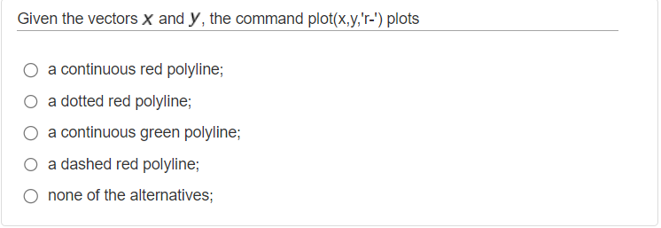
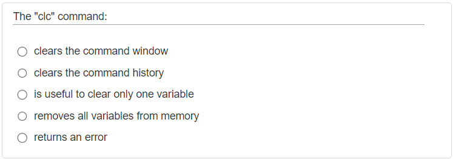

## Numerical Computing Matlab Questions
This repository includes matlab questions and their answers of Linear Algebra and Geometry course in Politecnico di Torino. 

We solved questions from portale of Polito and we tried to simplify the questions as much as possible with our explanations. 

The course subjects divided into 7 sub-subjects in portale. 

## Subjects

### [Syntax - Level 1 (W2)](#syntax---level-1-w2-1)

### [Sytanx - Level 2 (W2)](#syntax---level-2-w2)

### [Machine Arithmetic (W2)](#machine-arithmetic-w2-1)

### [Interpolation (W5)](#interpolation-w5-1)

### [Linear Systems - 1 (W9)](#linear-systems---1-w9-1)

### [Linear Systems - 2 (W9)](#linear-systems---2-w9-1)

### [Eigenvalues and matrix factorizations (W14)](#eigenvalues-and-matrix-factorizations-w14-1)

There are also 4 summarizing tests whose questions are more indicative of the types that will be used during the final test in the lab. Several topics are addressed in each quiz.

### [Quiz 0 (W5)](#quiz-0-w5-1)

### [Quiz 1 (W9)](#quiz-1-w9-1)

### [Quiz 2 (W10)](#quiz-2-w10-1)

### [Quiz 3 (W14)](#quiz-3-w14-1)

### Checkout [this section](#how-to-contribute-this-repository) below, if you want to add questions to this repository.

A note from Professor; 
1. Questions should **not be considered exhaustive of the course program**. Moreover, some questions are proposed with a high level of heterogeneity in terms of complexity.
2. The scores assigned during these quizzes are not related to the difficulty of the question.
3. Use the online help to understand the use of MATLAB commands that you have never dealt with.
4. You may repeat the quiz several times; typically new questions will be delivered.
5. The due time is not related to question number and/or complexity, and it is not related to the time you will be assigned for completing the quiz during the exam.
6. The different number of alternatives (4 in some cases, 5 in other ones) is not significant. The questions of the final test will have 5 alternatives.
7. For each quiz, we provide a qualitative indication of the course week in which the treatment of the topics is approximately completed so that you should be able to answer all questions in the quiz (for example W1 -> starting from week one; W4 -> starting from week four, and so on).

## Syntax - Level 1 (W2)
#### Q1


It asks us to write these equations in matlab. First, we can eliminate the wrong ones, in matlab after an `if` statement we use `elseif` statement to add another condition so we can eliminate option A, B and C. We have D and E options left. There is only one different in these options, `&&` and `&`. Both are logical `AND` operations. The `&&` though, is a "short-circuit" operator. 

From the MATLAB documentation: "They are short-circuit operators in that they evaluate their second operand only when the result is not fully determined by the first operand."

For example:

A & B (A and B are evaluated)

A && B (B is only evaluated if A is true)

So the correct answer will be `E`

#### Q2


`x & y` performs a logical `AND` of arrays x and y and returns an array containing elements set to either logical 1 (true) or logical 0 (false). An element of the output array is set to logical 1 (true) if both x and y contain a **nonzero** element at that same array location. Otherwise, the array element is set to 0.

`~y = not(y)` returns a logical array of the same size as y. The array contains logical 1 (true) values where **y is zero** and logical 0 (false) values where **y is nonzero**. So in our question it gives us an array of full zero because given y has nonzero elements.

`x&(~y)` returns a logical array of [0, 0, 0, 0, 0, 0] because we are taking their intersection. For this `&` operator to return a nonzero number, we need nonzero numbers both from x and y. Correct answer is `C`

#### Q3


A polyline is a list of points, where line segments are drawn between consecutive points.

While plotting, we can use different styles to plot our graph. There are some shorcuts for colors such as `r` is for red, `g` is for green etc. Also there are some shortcuts for line styles such as `-` is for solid line, `--` is for dashed line, `:` is for dotted line etc. So the correct answer will be `A`.

#### Q4


From Matlab documentation: `clc` clears all the text from the Command Window, resulting in a clear screen. Correct answer is `A`

#### Q5


In this question, we were asked 10 **sub-intervals**. linspace function creates n points between x and y but it creates n-1 sub-intervals between x and y points. So for this question, we need to choose linspace(-1,1,11) to get a 10 subintervals. Correct answer is `C` 

#### Q6


In this question, to divide the interval into `N` sub-intervals we need to use linspace(x,y,n+1) because linspace divides the intervals into n-1 sub-intervals but we need N amount of sub-intervals. We need to read carefully. Correct answer is `D`

#### Q7


From Matlab documentation: `clear` removes all variables from the current workspace, releasing them from system memory. `clear` removes a global variable from the current workspace but not other workspaces. Correct answer is `B`

#### Q8


`A == B` returns a logical array with elements set to logical 1 (true) where arrays A and B are equal; otherwise, the element is logical 0 (false). In this question fourth elements and seventh elements of x and y is equal so the answer will be [0 0 0 1 0 0 1]. Correct answer is `C`

#### Q9


From Matlab documentation: A./B divides each element of A by the corresponding element of B. A and B must have compatible sizes. In the simplest cases, they can be the same size or one can be a scalar. Correct answer is `A`

#### Q10


From Matlab documentation: contour(Z) creates a contour plot containing the isolines of matrix Z, where Z contains height values on the x-y plane. MATLAB® automatically selects the contour lines to display. The column and row indices of Z are the x and y coordinates in the plane, respectively. For more [checkout here](https://www.google.com/search?q=contour+level+curves+in+matlab&tbm=isch&ved=2ahUKEwiU8IjZjpT_AhXGyQIHHapECNMQ2-cCegQIABAA&oq=contour+level+curves+in+matlab&gs_lcp=CgNpbWcQAzoECCMQJ1CJDVjoF2DXG2gAcAB4AIABeYgBmAWSAQM4LjGYAQCgAQGqAQtnd3Mtd2l6LWltZ8ABAQ&sclient=img&ei=qT1xZNT3GMaTi-gPqomhmA0&bih=936&biw=882). Correct answer is `D`

#### Q11 


`.^`  Array power. From Matlab documentation: "A.^B denotes element-by-element powers. A and B must have compatible sizes. In the simplest cases, they can be the same size or one can be a scalar." We can eliminate option B, C and E from this definition. For option D, it doesn't needs to be n x n, we can use `.^` operator with 2 x 3 and 1 x 3 matrices so we can eliminate D. Correct answer is `A`

#### Q12 


From matlab documentation: "`>`  Greater than operator. A > B does element by element comparisons between A and B and returns an array with elements set to logical 1 (TRUE) where the relation is true and elements set to logical 0 (FALSE) where it is not." Correct answer is `E`

#### Q13


For this kind of questions, we need to be careful for small details. Question asked us to plot the function in an interval. We have x values in [1, 2] interval so we will use `plot` function because while using `fplot` function we define a function generally and let Matlab choose the x values and compute the y values. With this information, we can eliminate `fplot`, options B and E. In options A and C, there are typos in y function, it needs to be `y=x.^2+log(x)`. Be careful while using `.^`operator. Correct answer is `D` 

#### Q14


Unlike other code languages Python and Javascript, in Matlab indexing starts from 1. To get an index from given x vector, simply we can use `x(start index : number of steps : end index)`. Correct answer is `A`

#### Q15


From Matlab documentation: 
```
while expression
    statements
end

For example: 
while n > 1
    n = n-1;
end
```
Correct answer is `D`


## Syntax - Level 2 (W2)

***Questions will be added for this subject.***

## Machine Arithmetic (W2)

***Questions will be added for this subject.***

## Interpolation (W5)
#### Q1


In the problem, we have a function called f(x) = (1 - x^2)x^3. We want to find a polynomial, let's call it p(x), that passes through 7 equally spaced points on the interval from 0 to 1.

The degree of a polynomial tells us the highest power of x in that polynomial. To find the degree of the interpolating polynomial, we need to determine the minimum degree required to accurately represent the function f(x) using those 7 points.

In this case, the interpolating polynomial p(x) is expected to have a minimum degree equal to the number of points minus 1, which in this case is 7 - 1 = 6. However, the polynomial p(x) = x^3 - x^5 has a degree of 5, which is less than 6.

Since the degree of p(x) is lower than the minimum required degree of 6, we cannot use p(x) to accurately interpolate the function f(x) on the given points.

Therefore, the correct answer is E) no, since the interpolating polynomial has a minimum degree equal to 6.

#### Q2


An explanation will be added for this question.

#### Q3


To interpolate the function f(x) = sin(x) with a polynomial of higher degree using 5 linearly spaced nodes in the interval [0, π], including the extrema, When we say "linearly spaced nodes including extrema," it means that we want to choose equidistant points within the interval [0, π], with the endpoints 0 and π included. In this case, with 5 linearly spaced nodes, we will have the following x-values:

x = [0, π/4, π/2, 3π/4, π]

Including the extrema ensures that the interpolation polynomial will pass through those specific points as well.
we can use the MATLAB instructions as follows:
1. Define the x-values of the 5 linearly spaced nodes, including the extrema:

2. Calculate the y-values of the function f(x) = sin(x) at the given x-values:

3. Use the `polyfit` function in MATLAB to fit a polynomial of a higher degree to the data points.

For interpolation with 5 points, a polynomial of degree 4 can perfectly fit the data points, as it can pass through all 5 points. Thus, you would typically use a polynomial of degree 4 for this case.

Therefore, you should input a degree of 4 when using the polyfit function to fit the polynomial to the 5 data points.

4. Evaluate the polynomial at x = π/8 to find the value of the interpolating polynomial at that point:

The `polyval` function returns the value of the polynomial `p` at the point `x1`.

By following these steps, you can interpolate the function sin(x) with a polynomial of higher degree using 5 linearly spaced nodes in the interval [0, π]. The value of the interpolating polynomial at x = π/8 will be stored in the variable `y1`.
```
clear all
x=linspace(0,pi,5); 
y = sin(x);
p = polyfit(x,y,4);
x1= pi/8;
y1= polyval(p,x1)
```
#### Q4
#### Q5
#### Q6


## Linear Systems - 1 (W9)

***Questions will be added for this subject.*** 

## Linear Systems - 2 (W9)

***Questions will be added for this subject.***

## Eigenvalues and Matrix Factorizations (W14)

***Questions will be added for this subject.***
#### Q9


The question is asking us to perform 8 iterations of the QR method on the Hilbert matrix of order 12, starting with matrix A₀ = A. The Hilbert matrix is a specific type of matrix where its entries are given by the formula A(i, j) = 1 / (i + j - 1).

The QR method is an iterative numerical algorithm used to find the eigenvalues (and eigenvectors) of a matrix. In each iteration, the matrix A is decomposed into a product of an orthogonal matrix Q and an upper triangular matrix R. The resulting matrix R is then multiplied by Q to obtain the updated matrix A for the next iteration which is A = R*Q in matlab.

The question specifically asks for the approximate value of element A₈(3,3) after 8 iterations of the QR method. This means we need to perform the QR iterations as described above and retrieve the value at the third row and third column of the resulting matrix A after 8 iterations.

``` 
clear all 

format long e

A = hilb(12);
for i=1:8
    [Q, R] = qr(A);
    A = R*Q;
end
A(3,3)

```
First line creates a 12x12 Hilbert matrix and assigns it to the variable A. The hilb function generates the Hilbert matrix based on the specified order, in this case, 12.

The for loop performs 8 iterations of the QR method. In each iteration, the qr function decomposes matrix A into an orthogonal matrix Q and an upper triangular matrix R. The updated matrix A is obtained by multiplying R and Q. This process is repeated 8 times, as indicated by the loop.

Last line retrives the value at the third row and third column of the resulting matrix A after 8 iterations of the QR method.

Correct answer is 4.47e-02, in this case, `C`

## Quiz 0 (W5)


***Questions will be added for this subject.***

## Quiz 1 (W9)

***Questions will be added for this subject.***

## Quiz 2 (W10)

***Questions will be added for this subject.***

## Quiz 3 (W14)

***Questions will be added for this subject.***

### How to contribute this repository?
1. Firstly, you can fork this repository into your github.  
2. After making sure that the questions doesn't exist in this repository, you can add your question to the related subject with your explanation.
3. For the question photo, it needs to be **screenshot**, not taken by a mobile phone camera from a pc/tablet.
4. After adding, you can commit and send a pull request to this repository. 
5. Our editors will check your request and prepare for adding to this repository.
5. Congratulations! You have provided an important support to those who will embark on this adventure. Your name is now on the contributor list!